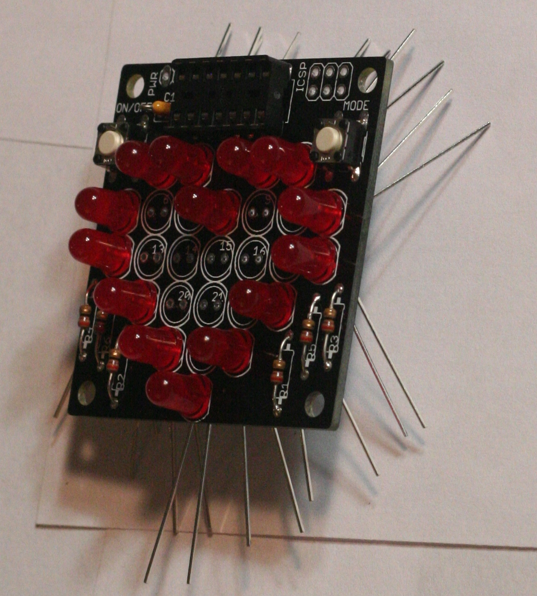

******************
Assembling the kit
******************

1. Check to make sure you have all the parts!
2. Resistors (R1-6)

   a) Bend and insert resistors

      |I1|

      |I2|

      |I3|

      |I4|

      |I5|

   b) Solder resistors to the board

      |I6|

      |I7|

   c) Clip resistor legs (see buttons below)

3. Buttons (ON/OFF and MODE)

   a) Insert buttons

      |I8|

      |I9|

   b) Solder buttons

      |I10|

   c) Clip button legs; they're pokey!

      |I11|

4. Insert, solder, and trim the socket (IC1)

   .. note:: 

      It is extremely important that the notch in the socket matches the
      dip printed on the board's outline

   |I12|

5. Capacitor (C1)

   a) You may need to bend it a lot

      |I13|

   b) Can stand it on-end

      |I14|

   c) Bend legs to help hold it in

      |I15|

6. LEDs (LED1-27)

   .. note::

      LEDs have a direction. The positive (longer) leg should be
      towards the ON/OFF side of the board. The negative side of
      the lens (the red part) is also flattened slightly; you
      should be able to see a white outline around the entire LED
      when it's inserted

   |I16|

   a) Insert, bend, solder, and clip the outer ring of LEDs first (numbers 1, 2,
      3, 4, 5, 11, 12, 18,19,23,24,26,27)

      |I17|

      |I18|

   b) Do the next ring of LEDs (numbers 6, 7, 8, 9, 10, 13, 17, 20, 22, 25)

      |I18a|

      |I19|

   c) Do the remaining four LEDs (numbers 14, 15, 16, 21)

      |I20|

      |I21|

7. Insert, solder, and clip the programmer connector (2x3 pins, ICSP)

   |I22|

8. Battery holder

   a) You might want to trim the wires to make it a bit neater

      |I23|

   b) Insert the battery leads and solder them

      .. note::

         The negative (black) wire should be connected on the side closer to
         the socket

      |I24|

9. You're done soldering!

   |I25|

10. Insert the chip into the socket (IC1)

    .. note::

       The chip has a small divet in it. This should face the notch in the
       socket. When looking at the top of the board, with the tip of the
       heart towards you, the text on the chip should be right-side up and
       read left to right

    |I26|

11. Optionally, make a stand by using the mounting tape to attach the
    side of the battery holder to the back of the board.
12. If you want to install firmware in the chip, you should connect the
    cable with the red stripe towards the socket

    |I27|

.. |I3| image:: photos/003_bend_resistor_legs_top.jpg
   :width: 4in

.. |I14| image:: photos/014_insert_capacitor.jpg
   :width: 4in

.. |I20| image:: photos/020_insert_remaining_leds.jpg
   :width: 4in

.. |I21| image:: photos/021_bent_remaining_led_legs.jpg
   :width: 4in

.. |I27| image:: photos/027_connect_programmer.jpg
   :width: 4in

